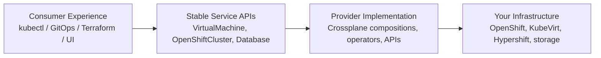

# What is Stakater Cloud Orchestrator?

Stakater Cloud Orchestrator (SCO) is a Kubernetes-native, self-hosted cloud platform that lets platform engineering teams define any service and deliver it to their organisation and customers through standard Kubernetes APIs.

## The Problem It Solves

Modern organisations face a recurring tension: infrastructure and platform teams need to maintain control, consistency, and security across shared resources — while developers and product teams need fast, self-service access to computing capacity, clusters, and tooling they depend on.

Traditional solutions force a compromise. Shared clusters create noisy-neighbour problems and blast-radius risks. Dedicated clusters per team are expensive and operationally unsustainable. Ticket-based provisioning slows delivery. Public cloud adds cost, egress fees, and data sovereignty concerns.

SCO resolves this tension by running a **cloud platform on top of your own infrastructure** — giving providers the control they need while giving consumers the self-service experience they expect.

## How It Works

SCO is built around two distinct roles:

### Platform Providers

Platform and infrastructure engineers define services as **Kubernetes custom resources**. A service might represent a virtual machine, an OpenShift cluster, a database, a message queue, a secrets engine, or any infrastructure primitive that your organisation needs to offer.

Providers compose these services from building blocks — cloud infrastructure, operators, internal APIs — and publish them to a **service catalogue** that consumers can browse and provision from.

Once published, the service is just a Kubernetes API endpoint. Consumers interact with it the same way they interact with any Kubernetes resource: `kubectl apply`, a GitOps pipeline, Terraform, or a web interface.

### Platform Consumers

Developers and teams provision services by applying Kubernetes claims. They get their own isolated **project** — a virtual Kubernetes environment with its own API server endpoint, network isolation, and resource quota — that behaves like a dedicated cluster but runs on shared infrastructure.

From within a project, consumers can:

- Provision virtual machines
- Request hosted OpenShift clusters
- Deploy any service published by their platform team
- Connect CI/CD pipelines, GitOps tooling, or Terraform to their project's API endpoint

They never touch the underlying infrastructure. They never need cluster administrator access. They work entirely within their project boundary using familiar Kubernetes tooling.

## The Abstraction Layer

The power of SCO lies in its **multi-layer abstraction**:



```text
Consumer Experience          Provider-Defined Services         Your Infrastructure
─────────────────────        ─────────────────────────         ──────────────────
kubectl / GitOps / tf   →    Virtual Machine                →  OpenShift + KubeVirt
                         →    OpenShift Cluster              →  Hosted Control Planes
                         →    Database                       →  Any operator or API
                         →    Custom Service                 →  Anything you compose
```

Each layer is independent. Providers change the implementation without touching the consumer API. Consumers don't know or care what's underneath — they declare what they want, and the platform delivers it.

## A Self-Hosted Cloud

SCO runs entirely on your own OpenShift cluster — on-premises, in a co-location facility, or in a private cloud. You control the infrastructure, the network boundaries, and the data. There are no dependencies on public cloud hypervisors, no vendor lock-in for compute, and no egress to external control planes.

This makes SCO particularly suited to:

- Organisations with data sovereignty or regulatory requirements
- Enterprises that have invested in on-premises or bare-metal infrastructure
- Managed service providers who need to host a multi-tenant cloud for their customers

## What's Next?

- [Key Features](key-features.md) - Explore what SCO enables
- [Use Cases](use-cases.md) - See how organisations run SCO in practice
- [Benefits](benefits.md) - Understand the business and operational value
- [Architecture](../architecture/architecture.md) - Explore the technical design
