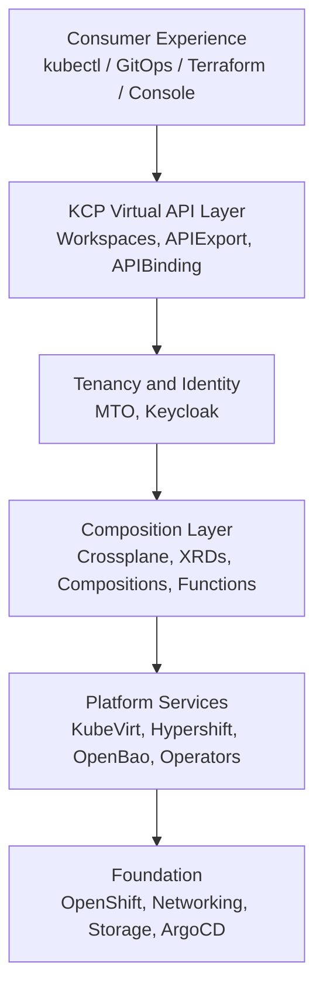
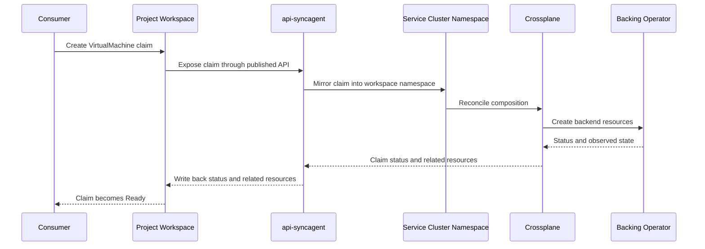

# Architecture

Stakater Cloud Orchestrator is built as a composition of open-source, Kubernetes-native components running on a single Red Hat OpenShift cluster. Each layer of the platform addresses a specific concern — foundation, orchestration, multitenancy, identity, secrets, and services — and integrates with the others through standard Kubernetes APIs.

---

## Design Principles

**Kubernetes-native throughout.** Every platform component is managed as a Kubernetes resource. Configuration is declarative, reconciliation is continuous, and the Kubernetes API is the universal integration surface.

**Open standards, no proprietary lock-in.** SCO relies on OIDC, Kubernetes API conventions, OCI, Helm, and open-source projects. There are no proprietary control planes or vendor-specific APIs in the critical path.

**GitOps-first.** Platform configuration is code, stored in version control, applied through a GitOps engine. Git defines the intended platform state and remains the primary audit trail, while runtime behaviour still depends on reconciliation across ArgoCD, Crossplane, KCP, and the backing operators. Changes are reviewed, audited, and rolled back the same way application changes are.

**Separation of concerns.** The composition layer (what services exist), the multitenancy layer (who can access what), the identity layer (who you are), and the secrets layer (what credentials you hold) are each handled by a dedicated system with a well-defined interface.

**Anything as a service.** The composition engine can wrap any Kubernetes operator, cloud API, or internal system and expose it as a Kubernetes custom resource. Providers define services once; the platform makes them available to all consumers without modification.

**Self-healing and declarative.** All resources are continuously reconciled. Deleted namespaces are recreated. Modified quotas are reverted. Failed compositions retry. Operators are reinstalled if removed. The platform continuously drives toward the desired state declared in Git.

---

## Platform Layers

The same architecture can be read as a layered dependency stack:



```text
┌─────────────────────────────────────────────────────────────────────┐
│                        Consumer Experience                          │
│         kubectl / GitOps / Terraform / Console                      │
├─────────────────────────────────────────────────────────────────────┤
│                       Virtual API Layer (KCP)                       │
│   Per-project Kubernetes API endpoints · APIExport / APIBinding     │
├─────────────────────────────────────────────────────────────────────┤
│                     Tenancy & Identity Layer                        │
│   Multi-Tenant Operator (quotas, network, RBAC) · Keycloak (IDP)   │
├─────────────────────────────────────────────────────────────────────┤
│                      Composition Layer (Crossplane)                 │
│   Service definitions · Infrastructure orchestration · Secrets      │
├───────────────────────────┬─────────────────────────────────────────┤
│   Infrastructure Services │   Platform Services                     │
│   OpenShift Virt · Hypershift · OpenBao · Operators                │
├─────────────────────────────────────────────────────────────────────┤
│                     Foundation (Red Hat OpenShift)                  │
│   Cluster · Networking · Storage · Registry · GitOps (ArgoCD)      │
└─────────────────────────────────────────────────────────────────────┘
```

### Foundation: Red Hat OpenShift

Everything runs on a single Red Hat OpenShift cluster. OpenShift provides the Kubernetes API, container runtime, cluster networking (OVN-Kubernetes), persistent storage (OpenShift Data Foundation or CSI providers), the internal image registry, and the underlying node management.

OpenShift is not just a runtime substrate — it also provides a richer CRD ecosystem (Routes, BuildConfigs, DeploymentConfigs, operator lifecycle management) and the security model (SCC, RBAC defaults) that SCO builds on.

### Platform Orchestration: ArgoCD

ArgoCD (deployed via OpenShift GitOps) is the engine that installs and maintains every platform component. The platform's desired state — which operators are installed, what version, with which configuration — is declared in Git and continuously reconciled by ArgoCD against the cluster.

This means:

- Platform upgrades are Git commits, reviewed and merged like any code change
- The cluster's state is always auditable from the repository history
- Drift between declared and actual state is detected and corrected automatically
- Rollback is a Git revert

ArgoCD manages not just application deployments but the operators, CRDs, `OperatorGroup` and `Subscription` resources, platform Crossplane compositions, and all SCO-specific configuration.

### Composition Layer: Crossplane

Crossplane plays two distinct roles in SCO.

**Platform orchestration:** SCO itself is installed and configured through Crossplane compositions. When the `ksp up` CLI runs, it applies `KubeStackPlus` and `KubeStackConfig` claims that Crossplane reconciles — installing KCP, Keycloak, MTO, OpenBao, Hypershift, and all other platform components in the correct order. The platform is not set up by a Helm chart or an Ansible playbook; it is a running Crossplane composition that continuously maintains the platform's desired state.

**Service composition engine:** Platform providers use Crossplane to define services — as XRDs and compositions — that consumers can provision via Kubernetes claims. The composition engine handles the gap between what a consumer declares and what needs to be created in the underlying infrastructure. Providers write KCL functions to express business logic; Crossplane runs them.

### Infrastructure Services

These are the purpose-built operators and systems that back the SCO built-in services:

- **OpenShift Virtualization (KubeVirt):** Enables VMs to run as Kubernetes objects on bare-metal nodes. Powers the `VirtualMachine` service. Provides live migration, snapshots, and hardware pass-through.
- **Hypershift:** Hosted control plane technology that runs OpenShift cluster control planes as pods. Powers the `OpenShiftCluster` service. Dramatically reduces the resource cost of multi-cluster deployments.
- **OpenBao:** The open-source secrets management platform (community fork of HashiCorp Vault). Provides dynamic secrets, PKI, and key-value storage for both platform components and consumer workloads. Crossplane compositions use the OpenBao provider to issue and rotate credentials automatically.

### Tenancy and Identity Layer

- **Multi-Tenant Operator (MTO):** Enforces tenancy in the physical cluster. For every project, MTO creates and continuously reconciles namespaces, `ResourceQuota`, `LimitRange`, `NetworkPolicy`, and RBAC resources. No tenant can breach these boundaries regardless of what they apply to their virtual API endpoint.
- **Keycloak:** Provides one isolated identity realm per organisation. Each organisation's users, groups, SSO configuration, and OIDC clients are scoped to their realm. Group membership in Keycloak is automatically propagated into Kubernetes RBAC within the project.

### Virtual API Layer: KCP

KCP (Kubernetes Control Plane) provides each project with its own fully isolated Kubernetes API endpoint — a workspace — without running a separate physical cluster. Consumers use standard tools (`kubectl`, ArgoCD, Terraform, Flux) against their workspace URL. KCP serves only the APIs that have been exported and bound into that workspace; the `api-syncagent` then mirrors those claims onto the service cluster for Crossplane to reconcile.

---

## Request Flow

A consumer provisioning a virtual machine follows this path:



```text
1. Consumer applies VirtualMachine claim to their project kubeconfig
        ↓
2. KCP workspace receives the API request
        ↓
3. The claim is stored under an API that was previously published via
   APIExport and bound into the workspace via APIBinding
        ↓
4. api-syncagent observes the new object through the exported API's
   virtual workspace endpoint
        ↓
5. api-syncagent creates a VirtualMachine object in the consumer's
   namespace on the service cluster
        ↓
6. Crossplane composition pipeline runs (KCL functions)
        ↓
7. Composed resources created:
   - KubeVirt VirtualMachine
   - DataVolume (OS disk)
   - Service (network access)
        ↓
8. KubeVirt reconciles the VM on a bare-metal hypervisor node
        ↓
9. Status and any published related resources are propagated back
   through Crossplane → api-syncagent → KCP workspace
        ↓
10. Consumer sees Ready status on their VirtualMachine claim
```

The consumer never knows the path through KCP, the `api-syncagent`, or KubeVirt. They see a Kubernetes resource that went from `Pending` to `Ready`.

---

## Deployment Topology

All SCO components run within the single management OpenShift cluster:

```text
Management OpenShift Cluster
├── openshift-gitops          ArgoCD — platform GitOps engine
├── stakater-crossplane       Crossplane + providers + compositions
├── kcp-system                KCP control plane + api-syncagent pods
├── stakater-keycloak         Keycloak (multi-tenant IDP)
├── stakater-mto              Multi-Tenant Operator
├── stakater-openbao          OpenBao secrets engine
├── openshift-cnv             OpenShift Virtualization (KubeVirt)
├── hypershift                Hypershift operator
├── consumer-namespaces/      One namespace set per project (MTO-managed)
│   ├── ws-org-acme-frontend-*
│   └── ws-org-acme-backend-*
└── [operator namespaces]     Strimzi, CNPG, RHOAI, cert-manager, etc.
```

Hosted OpenShift cluster control planes (provisioned via Hypershift) also run as pods within the management cluster, in namespaces scoped per hosted cluster.

---

## What's Next?

- [Components](components.md) — Per-component reference: role, configuration, and integration points
- [Virtual API Layer](virtual-api-layer.md) — Deep dive into KCP, workspaces, and the API flow
- [Core Concepts](concepts.md) — Platform vocabulary: organisations, projects, solutions
- [KCP Integration](../integrations/kcp.md) — KCP configuration and workspace management
- [Crossplane Integration](../integrations/crossplane.md) — Writing compositions and managing providers
