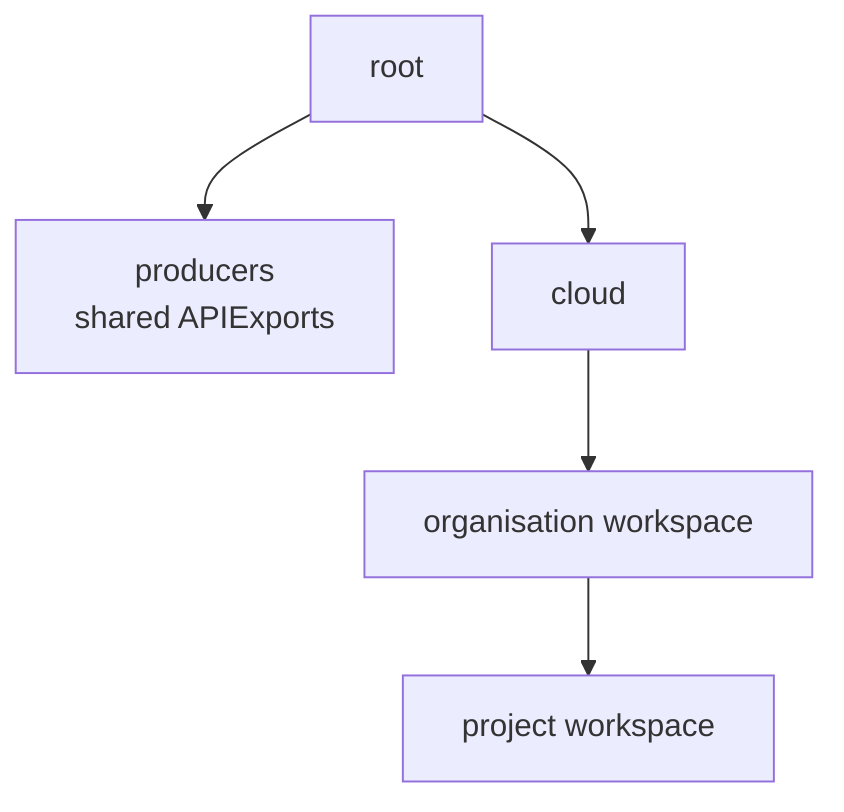
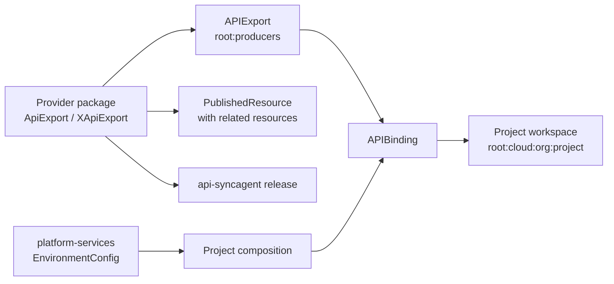

# Virtual API Layer

The virtual API layer is the mechanism that gives every project its own isolated Kubernetes API endpoint without running a separate physical cluster for each one. It is implemented by KCP (Kubernetes Control Plane) and is what makes the SCO model of per-project isolation practical at scale.

---

## The Problem with Shared API Servers

In a conventional Kubernetes cluster, every tenant shares one API server. Resources are separated by namespace, but the API surface itself — which resource types exist, what CRDs are installed, which API groups are available — is identical for every tenant. A CRD installed for one tenant is visible to all tenants.

Namespace-level isolation has limits: blast radius, noisy neighbours on the API server, and the inability to give different tenants different API surfaces. The alternative — one physical cluster per tenant — is expensive and difficult to operate at scale.

KCP solves this by serving thousands of independent virtual API servers (workspaces) from a single lightweight process.

---

## How KCP Workspaces Work

A KCP workspace is a virtual Kubernetes environment. It has:

- **Its own API server endpoint** — a unique URL with its own TLS certificate and kubeconfig
- **Its own resource set** — objects created in one workspace cannot be seen from any other
- **Its own API surface** — the set of resource types (CRDs) available can differ per workspace
- **Its own RBAC** — access grants are scoped within the workspace, not shared across workspaces
- **Its own OIDC issuer** — token validation is workspace-scoped, backed by the organisation's Keycloak realm

KCP stores all workspace state in a shared etcd, but each workspace is logically isolated. The KCP process serves each workspace API from a single binary — there is no per-workspace API server pod or separate control plane process.

This makes workspaces extremely lightweight. Under healthy control-plane conditions, provisioning a new project workspace is typically a matter of seconds and requires no additional compute resources proportional to the number of projects.

---

## Workspace Hierarchy in SCO

SCO organises workspaces in a three-level tree. The exact path layout in the current platform includes a shared producer workspace for exports and a `cloud` branch for tenant-facing workspaces:



```text
root
├── producers
│   Holds: shared APIExports for published service APIs
│
└── cloud
    ├── org-acme  (organisation workspace)
    │   │  Holds: organisation-scoped configuration
    │   │
    │   ├── proj-frontend  (project workspace)
    │   │     Holds: APIBindings, consumer claims (VirtualMachine, etc.)
    │   │     Endpoint: https://kcp.example.com/clusters/root:cloud:org-acme:proj-frontend
    │   │
    │   └── proj-backend  (project workspace)
    │         Holds: APIBindings, consumer claims
    │         Endpoint: https://kcp.example.com/clusters/root:cloud:org-acme:proj-backend
    │
    └── org-globex  (organisation workspace)
        └── proj-apps
```

**Root and producer workspaces:** Owned by the platform team. Published service APIs are exported from the shared producer workspace, while platform-level configuration and templates live higher in the hierarchy.

**Organisation workspaces:** One per customer or business unit. Hold IAM resources — user and group definitions that are projected into Keycloak realm configuration. Organisation workspaces are not directly accessed by consumers.

**Project workspaces:** One per team or workload environment. These are the consumer-facing endpoints. Each project workspace contains `APIBinding` resources created by the `Project` composition from the currently selected platform-services configuration, importing the published API groups that should be available there.

---

## `APIExport` and `APIBinding`

### `APIExport`

An `APIExport` lives in the producer side of the platform workspace hierarchy and declares that a set of Kubernetes resource types is available for other workspaces to consume.

When a platform provider publishes a new service (e.g., `database.cloud.stakater.com/v1 PostgreSQLDatabase`), an `APIExport` is created for that API group. The export includes:

- The set of resource types included (kinds, versions)
- Permission claims — the access the export's controller (the `api-syncagent`) requires in consumer workspaces to manage the objects placed there

### `APIBinding`

An `APIBinding` lives in a project workspace and declares that this workspace should have access to a particular `APIExport`. When a binding is created, KCP makes the exported resource types available as native API types in the workspace.

SCO creates `APIBinding` resources for project workspaces through the `Project` composition. In practice this means APIs become available only when they are both published and present in the platform-services configuration consumed during project reconciliation; consumers do not configure bindings themselves.

When a consumer runs `kubectl api-resources` against their project kubeconfig, they see all bound resource types as if they were built into their cluster.



### How KCP Handles API Requests

When a consumer applies a resource to their project workspace:

1. KCP validates the request against the API schema declared in the `APIExport`
1. KCP stores the object in the workspace etcd partition
1. KCP notifies the `APIExport`'s virtual workspace endpoint that a new object is present
1. The `api-syncagent` (watching that virtual workspace) picks up the new object

The object in the consumer workspace is the source of truth for the consumer. Its status, conditions, connection details, and any explicitly published related resources are written back to it by the `api-syncagent`. The consumer never needs to know that the object is being reconciled on a different cluster.

---

## The API Sync Agent

The `api-syncagent` is the bridge between KCP workspaces and the Crossplane service cluster. For each published API group, a dedicated sync agent process watches the virtual workspace endpoint associated with the `APIExport`.

**Sync flow:**

```mermaid
flowchart LR
    Claim[Consumer claim<br/>in project workspace] --> VWS[KCP virtual workspace endpoint]
    VWS --> Sync[api-syncagent]
    Sync --> Host[Mirrored claim<br/>in service-cluster namespace]
    Host --> Crossplane[Crossplane composition]
    Crossplane --> Backend[Backend operator resources]
    Backend --> Observed[Observed Secret or status]
    Observed --> SyncBack[api-syncagent related-resource sync]
    SyncBack --> WorkspaceSecret[Status and related Secret<br/>back in workspace]
```



```text
Consumer workspace (project-frontend)
    VirtualMachine claim applied
           │
           ▼
KCP virtual workspace endpoint
    (for compute.cloud.stakater.com APIExport)
           │
           ▼
api-syncagent (watching the virtual workspace)
           │
           ├── Creates: namespace ws-proj-frontend-vms (if not exists)
           ├── Creates: VirtualMachine object in that namespace
           │           (mirroring the consumer's claim)
           │
           ▼
Crossplane composition runs
    Produces: KubeVirt VirtualMachine, DataVolume, Service
           │
           ▼
api-syncagent syncs status back
           │
           ▼
Consumer workspace: VirtualMachine shows Ready
```

**Namespace mapping:** For each consumer workspace, the sync agent creates a dedicated namespace on the service cluster (named after the workspace, with a suffix from the published resource's `namespaceSuffix` parameter). This keeps objects for different consumers physically isolated at the namespace level, even though they arrive through the same `api-syncagent` process.

**Deletion:** When a consumer deletes their claim, the `api-syncagent` removes the object from the service cluster namespace. Crossplane's composition engine handles the deletion of all composed resources (VMs, volumes, networking) in the correct dependency order.

---

## Project Workspace Lifecycle

### Provisioning

When a consumer creates a `Project` claim, SCO:

1. Creates the KCP project workspace (child of the organisation workspace)
1. Generates a kubeconfig for the project workspace and makes it available
1. Creates `APIBinding` resources in the project workspace for the published API groups selected through the platform-services configuration
1. Creates a `Tenant` resource in MTO, triggering namespace, quota, and network policy provisioning
1. Configures RBAC in the workspace based on the project's `access` configuration

The workspace is typically ready quickly once the workspace, bindings, and backing tenant resources have reconciled. The consumer receives a kubeconfig and can begin applying resources after those steps complete.

### Authentication

Each KCP workspace validates tokens against the organisation's Keycloak realm. A consumer authenticates to Keycloak (via OIDC), receives a token scoped to their organisation, and uses that token against their project workspace API server. KCP validates the token signature against the organisation's realm public key.

RBAC within the workspace controls which resource types a user can interact with and at what permission level.

### kubeconfig Structure

A project workspace kubeconfig looks like a standard Kubernetes kubeconfig:

```yaml
apiVersion: v1
kind: Config
clusters:
  - name: proj-frontend
    cluster:
      server: https://kcp.example.com/clusters/org-acme:proj-frontend
      certificate-authority-data: <ca-data>
users:
  - name: alice
    user:
      exec:
        # OIDC token exchange via kubelogin / oidc-login
        apiVersion: client.authentication.k8s.io/v1beta1
        command: kubectl
        args: [oidc-login, get-token, ...]
contexts:
  - name: proj-frontend
    context:
      cluster: proj-frontend
      user: alice
```

Standard tools — `kubectl`, ArgoCD, Flux, Terraform — work against this kubeconfig without modification.

### Deletion

When a project is deleted:

1. SCO removes `APIBinding` resources from the workspace (preventing new claims)
1. The `api-syncagent` completes deletion of all synced objects on the service cluster
1. Crossplane compositions delete all composed resources
1. MTO removes the tenant's namespaces and contained objects
1. KCP deletes the workspace and its etcd partition

Deletion is ordered and safe — infrastructure resources are not deleted until Crossplane confirms their removal.

---

## Scaling Characteristics

The KCP workspace model is designed for high workspace counts. A single KCP instance can serve tens of thousands of workspaces with low per-workspace overhead.

For large deployments, the platform can run multiple KCP instances with workspace routing distributed across them.

---

## What's Next?

- [KCP Integration](../integrations/kcp.md) — Configuration, workspace management, and operator access
- [Publishing APIs](../service-provider-guide/api-publishing/publishing-apis.md) — How to expose a new service through the virtual API layer
- [Components](components.md) — Overview of all platform components
- [Architecture](architecture.md) — Platform layers and design principles
