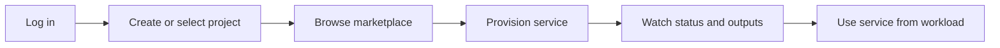

# Cloud Consumer Guide Overview

Welcome to the cloud consumer path. This section is for developers, team leads, and organisation administrators who consume services from the SCO marketplace.

## Who Is This Guide For?

This guide is designed for:

- **Developers**: Building applications using SCO services
- **Team Leads**: Managing projects and resources
- **DevOps Engineers**: Integrating with CI/CD and GitOps workflows
- **Application Teams**: Consuming managed services

## What You'll Learn

This guide covers:

- Creating and managing projects
- Browsing and provisioning solutions from the marketplace
- Accessing SCO using kubectl, Terraform, and GitOps tools
- Managing users and authentication
- Understanding project structure and isolation

The typical cloud user journey starts with access to an isolated project and ends with a running service instance:

## Key Personas

Throughout this guide, you'll see examples featuring:

- **Emma** - Developer who builds applications using SCO services
- **Jordan** - Team Lead who manages projects and coordinates the team

## What's Next?

- [Getting Started](getting-started.md) - Quick start guide for cloud users
- [Creating Projects](projects/creating-projects.md) - Set up your workspace
- [Browsing Marketplace](solutions/browsing-marketplace.md) - Find services
- [Cloud Consumer Documentation](../audience/cloud-consumers.md) - Return to the consumer landing page
