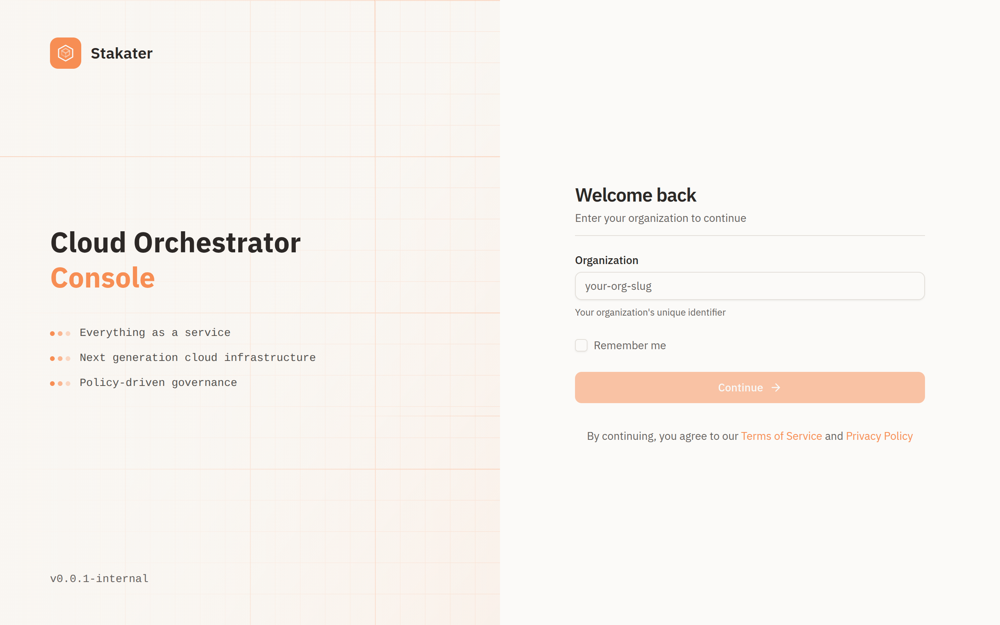

# Accessing the Console

Access to the console is scoped per organisation. Each organisation has its own identity provider, and you sign in to one organisation at a time.

---

## Step 1: Open the Console

Navigate to your console URL in a browser. Your platform administrator provides this URL, or you may receive it in a welcome email when your account is created.

If you are not signed in, the console shows the sign-in page.

---

## Step 2: Enter Your Organisation

On the sign-in page, enter your **organisation identifier** — the short slug that identifies your organisation on the platform. Your administrator provides this.

Select **Remember me** to keep your organisation selected on this browser for next time.

---

## Step 3: Sign In With Your Identity Provider

After you continue, the console hands you to your organisation's identity provider (IdP) to authenticate. Enter your credentials there — a username and password, or your corporate single sign-on, depending on how your organisation is configured.

!!! note
    Because authentication happens at your organisation's IdP, the exact sign-in screen and available methods are controlled by your organisation, not by the console.

Once you authenticate, you are returned to the console and land on the [dashboard](dashboard.md).

---

## Logging Out

Open the **account menu** in the top-right of the console and select **Log out**.

---

## What's Next?

- [Console Overview](overview.md) — Find your way around the console
- [Organizations](organizations.md) — How organisations work in the console
- [Logging In](../cloud-user-guide/authentication/logging-in.md) — Authentication and access concepts
- [Projects](projects.md) — Work with projects
