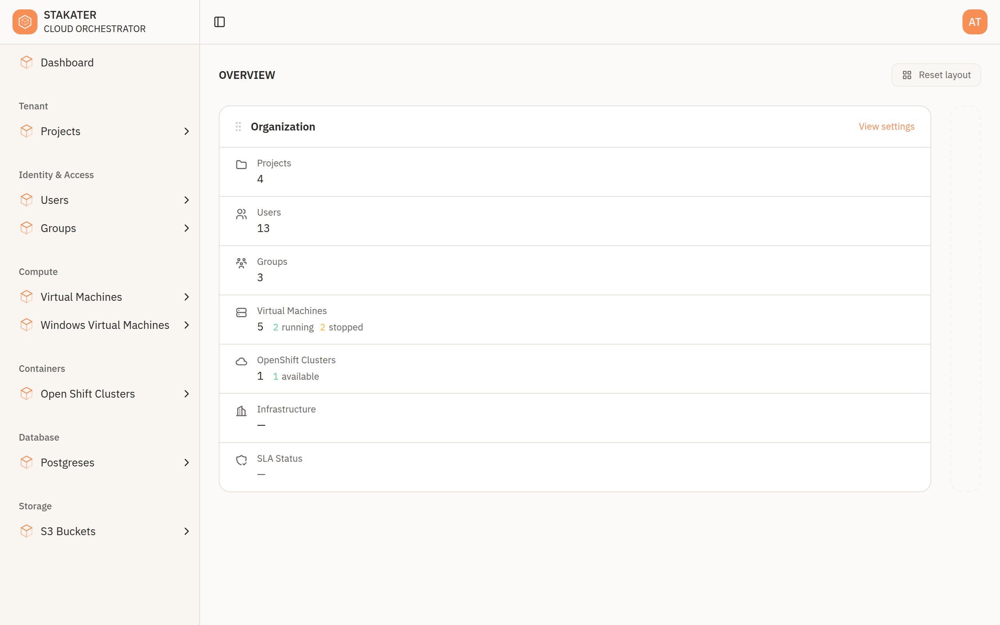

# Dashboard

The dashboard is the landing page after you sign in. It gives you a quick view of your organisation before you drill into individual resources.

---

## Your Organisation at a Glance

The dashboard summarises your organisation with live counts drawn from the platform, such as the number of:

- Projects
- Organisation users and groups
- Virtual machines
- Clusters

These figures reflect what currently exists in your organisation and what you have access to. Use them as a starting point, then open the matching section in the sidebar to see the details — see [Working with Resources](resources.md).

!!! note
    The dashboard will grow over time with additional views. This page documents what is available today.

---

## What's Next?

- [Console Overview](overview.md) — Find your way around the console
- [Projects](projects.md) — Work with projects
- [Working with Resources](resources.md) — Browse, provision, and manage services
