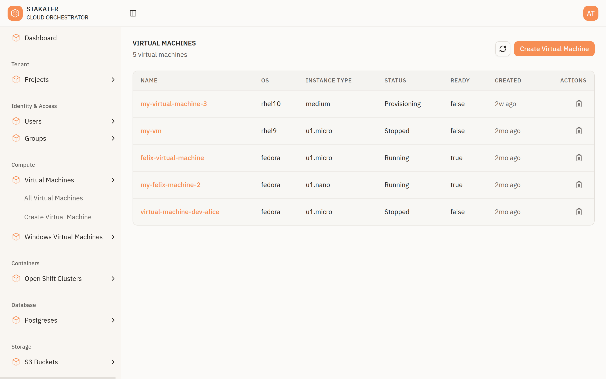
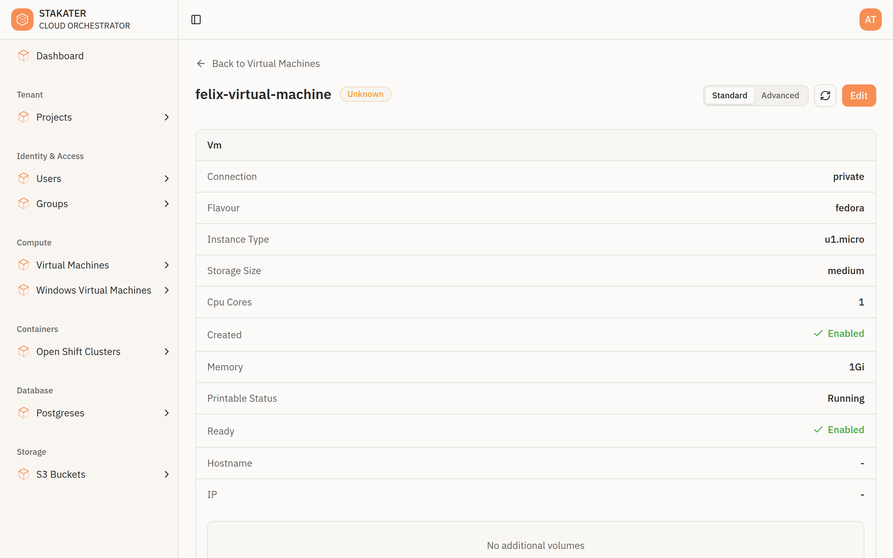
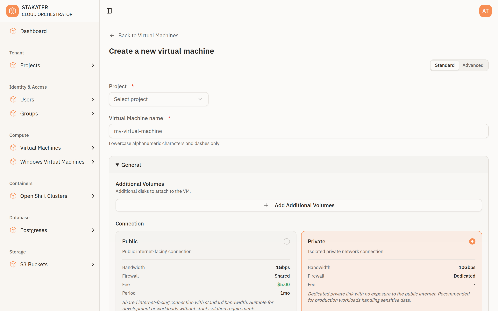
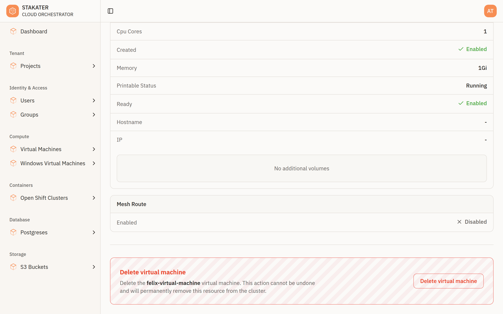
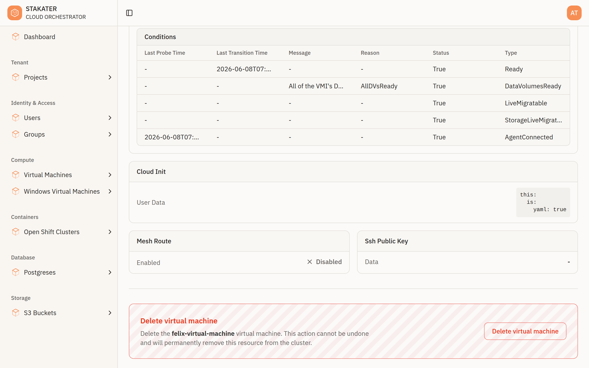

# Working with Resources

The console uses the same set of views for every kind of resource your organisation exposes — virtual machines, clusters, databases, storage, organisation users and groups, projects, and more. Once you know how one resource works in the console, you know how they all work.

Each resource type has four views: a **list**, a **detail** page, a **create** form, and an **edit** form. The fields and columns you see are driven by each resource's schema, so they match the resource you are working with.

---

## Browsing Resources

Select a resource in the sidebar and choose **All `<resources>`** to open its list. The list is a table showing each resource with its key columns and a **status** badge. Use **Refresh** to re-fetch the latest state.

---

## Viewing a Resource

Select a row to open the resource's detail page. It shows:

- A header with a link back to the list, the resource's **name**, and its current **status**
- A **Standard / Advanced** toggle, a **Refresh** button, and an **Edit** button
- The resource's details, organised into sections
- A **Delete** button at the bottom of the page

---

## Provisioning a Resource

Creating a resource in the console is how you provision a service.

1. Open the resource in the sidebar and select **Create `<resource>`**.
1. Choose the **project** to create it in. Only projects where you can create that resource are offered.
1. Give the resource a **name**.
1. Fill in the fields. Related fields are grouped into sections to make longer forms easier to work through.
1. Switch to **Advanced** mode if you need a field that is hidden in Standard mode.
1. Submit. The console validates your input, the platform provisions the resource, and you are taken to its detail page.

!!! tip
    Start in **Standard** mode. It shows the fields most people need; the defaults handle the rest. Switch to **Advanced** only when you need finer control.

For service-specific guides, see the how-to guides — for example [Provision a Virtual Machine](../how-to-guides/user/provision-virtual-machine.md), [Provision an OpenShift Cluster](../how-to-guides/user/provision-openshift-cluster.md), [Create a PostgreSQL Database](../how-to-guides/user/create-postgres.md), and [Create an S3 Bucket](../how-to-guides/user/create-s3-bucket.md).

---

## Editing and Deleting

From a resource's detail page:

- Select **Edit** to open the edit form. It works like the create form and is pre-filled with the resource's current configuration.
- Use the resource's **Delete** action to remove it. You are asked to confirm before anything is deleted.

---

## Standard and Advanced Mode

The **Standard / Advanced** toggle on create, edit, and detail pages controls how much detail is shown. Standard hides advanced, lower-level fields; Advanced reveals them. Your choice is remembered in your browser. See [Console Overview](overview.md#standard-and-advanced-mode).

The screenshot below is the same virtual machine detail page shown in [Viewing a Resource](#viewing-a-resource), switched to **Advanced** — it now includes the lower-level fields that Standard hides.

---

## Permissions

You only see the resources, actions, and projects you have been granted access to. If a resource or a **Create** action is missing, you likely do not have permission — contact your organisation administrator.

---

## What's Next?

- [Projects](projects.md) — Where resources live
- [Console Overview](overview.md) — Find your way around the console
- [API Reference](../api-reference/overview.md) — The resources behind the console
