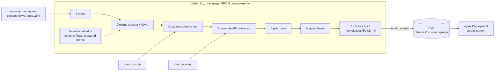

# White-label docs: design for review

2026-09-29. Short form. Detail in [2026-09-18-whitelabel-docs-proposal.md](2026-09-18-whitelabel-docs-proposal.md).

## What

One builder image, one Job, running in the customer's cluster. It clones the customer's overlay repo, merges it
over the baseline baked into the image, captures screenshots of their console, generates the API reference from
their gateway, and serves the result. Output is branded, and covers the APIs they actually deploy.

Today `sco-docs` ships one image for everyone: content baked at `Dockerfile:6`, screenshots against one hardcoded
console (`screenshots/config.env:5`), theme from a private submodule (`.gitmodules:2`), API reference as it is in the repo.

## How

Only steps 3 and 4 need the cluster, and both become local Service calls, so no credential leaves the cluster and
the console needs no public route. Helm knows only where the repo is and how to authenticate; everything else is
`docs.yaml` in the customer's repo.

## Tasks

| | Task | Owns | Notes |
|---|---|---|---|
| T1 | Walking skeleton | 1, 2, 7, release swap + Helm chart | Plain directory merge. Overlay-only pages auto append to one section, because `strict: true` (`theme_override/mkdocs.yml:8`) fails on a page outside the nav |
| T2 | Theme | 6 | Cheapest. Palette is already `primary: custom` with `extra_css` wired, so this is two CSS variables plus asset layering |
| T3 | Menu manipulation | 5 | `add` / `remove` / `rename`. `remove` also deletes the file |
| T4 | Screenshots | 3 | Shell loop over baseline + overlay flows. Needs a seeded demo org per customer |
| T5 | API reference | 4 | Renderer not yet chosen |

T1 owns both ends. T2 to T5 each slot one step into the middle, against a directory contract, so they run in
parallel once T1 lands.

## Decisions

| Decision | Why |
|---|---|
| One image with scripts, not Jobs sharing a PVC | One exit code, one log stream, atomic. Separate Jobs need orchestration and leave partial state on a shared volume |
| `FROM ghcr.io/stakater/browser-runner` | Inherits the Playwright and Chromium pin asserted at `browser-runner/Dockerfile:8,23`. Costs about 1GB, pulled once per node |
| Baseline baked, overlay cloned at runtime | Image tag is the baseline version. A prose fix rebuilds nothing |
| Overlay-only customer repo | Upgrading is a tag bump, so merge conflicts are impossible |
| Job plus PVC, not an initContainer on the serving Deployment | A failed rebuild must leave the previous site serving |
| Build into `releases/BUILD_ID`, then `ln -sfn` a `current` symlink | The rename is atomic, so nginx never serves a half written tree. mkdocs writes progressively. Keeping the last few releases makes rollback a re-point |
| Fail closed on any declared flow or API that cannot be produced | Chosen over pruning pages or falling back to baseline images |

## Open

1. **Renderer for T5.** CRD YAML is derivable from the merged spec, proven, about 25 lines, so `crdoc` is usable.
   `gen-apidocs` also fits but is wired to the Kubernetes release process. Needs a short bake off against
   `content/api-reference/public-apis/s3-bucket.md`.
2. **Description quality.** Only 37% of `spec.*` fields carry a description, 23% of required ones. Generation
   produces field tables; the hand written prose stays. Fixing it properly means richer descriptions in the KCL
   packages, which improves the console's form hints too.
3. **Storage.** The release swap handles atomicity and rollback, but the Job and nginx still share the volume. On
   `ReadWriteOnce` that needs both on one node. Confirm the target clusters have an RWX storage class, or pin with
   node affinity.
4. **Demo org.** Every customer needs one seeded before their first green build. Whose runbook?
5. **Portable image.** A PVC cannot produce an image the customer runs elsewhere. If that is wanted, build it in CI
   from a captured artifact rather than inside the customer cluster, where kaniko, rootless buildah and OpenShift
   `BuildConfig` all carry real friction and the capture step needs live credentials anyway.
